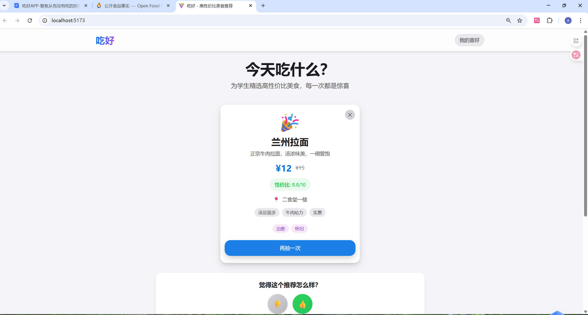

# 吃好 - 高性价比美食推荐平台

[English](./README.en.md) | 简体中文

一个面向学生群体的美食推荐Web应用，通过盲盒抽取的趣味方式推荐高性价比美食。

## 项目特色

- **🎲 盲盒式体验** - 每次抽取都是惊喜，解决选择困难症
- **💰 高性价比** - 专为学生群体筛选性价比高的美食
- **🎯 智能推荐** - 基于用户偏好的智能推荐算法
- **😊 情绪价值** - 关注食物带来的情绪体验
- **🍎 苹果风格UI** - 简洁优雅的设计风格

## 技术栈

- **React 19** + **TypeScript** - 类型安全的前端框架
- **Vite** - 快速的构建工具
- **Tailwind CSS** - 原子化CSS框架
- **Framer Motion** - 强大的动画库

## 快速开始

### 1. 安装依赖

```bash
cd chihao-app
npm install
```

### 2. 启动开发服务器

```bash
npm run dev
```

访问 http://localhost:5173 查看应用

### 3. 构建生产版本

```bash
npm run build
```

## 项目结构

```
src/
├── components/       # React 组件
│   ├── BlindBox.tsx       # 盲盒抽取组件
│   └── FeedbackPanel.tsx  # 反馈面板组件
├── data/            # 数据文件
│   └── mockFoods.ts       # Mock 食物数据
├── types/           # TypeScript 类型定义
│   └── food.ts            # 食物相关类型
├── utils/           # 工具函数
│   └── recommendation.ts  # 推荐算法
├── App.tsx          # 主应用组件
├── main.tsx         # 应用入口
└── index.css        # 全局样式
```

## 核心功能

### 1. 盲盒抽取
- 炫酷的抽取动画效果
- 完全随机（初期）或基于偏好（交互5次后）
- 每天不限次数

### 2. 智能推荐算法
- 类别偏好权重 (30%)
- 情绪标签匹配 (30%)
- 价格区间匹配 (20%)
- 性价比分数 (20%)

### 3. 用户偏好记录
- 本地存储用户交互历史
- 实时更新偏好权重
- 保留最近100条交互记录

### 4. 情绪价值体验
- 6种情绪标签：开心、治愈、元气、放松、怀旧、刺激
- 用户可以为喜欢的食物标记情绪
- 基于情绪反馈优化推荐

## 数据扩展

当前使用Mock数据（15种食物），后续可以接入真实API。

## 📸 截图

<div align="center">
  
  <p><em>盲盒抽取结果 - 兰州拉面推荐界面</em></p>
</div>

## 📚 开发文档

- [开发流程指南](./DEVELOPMENT_GUIDE.md)

## 🤝 贡献

欢迎提交 Issue 和 Pull Request！

## License

MIT © 2025
