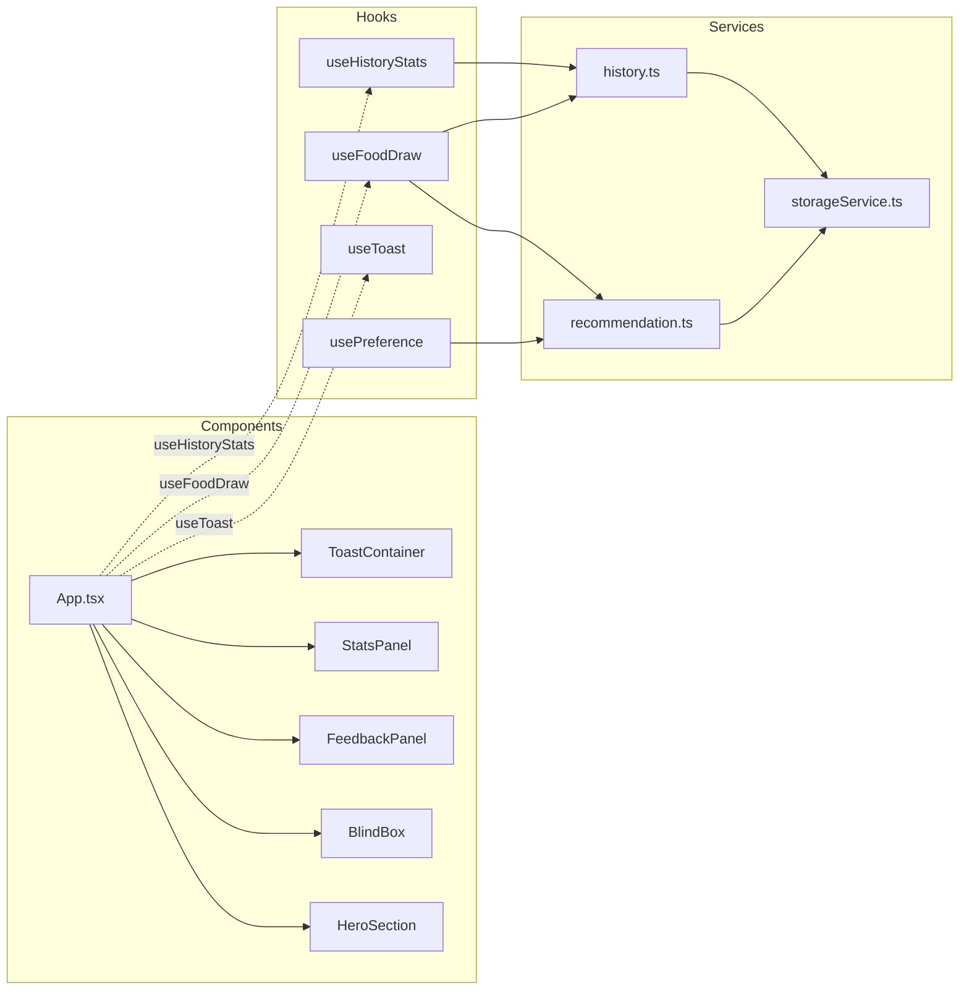

# Affordable-and-nutritious-food 架构分析与重构建议

> 分析时间：2025-11-01  
> 分析对象：`chihao-app`（React 19 + TypeScript + Tailwind + Framer Motion）  
> 分析目标：识别当前架构的优势与痛点，给出分阶段的演进与重构建议。

---

## 0. 项目快速概览

- **应用定位**：纯前端「盲盒抽美食」体验，依赖 LocalStorage 存储用户偏好与抽取历史。
- **技术栈**：React 19、TypeScript 严格模式、Vite、Tailwind、Framer Motion。
- **核心业务模块**：
  - `App.tsx`：全局状态协调中心（623 行）。
  - `components/`：视觉与交互组件（如 BlindBox、FeedbackPanel、Toast 等）。
  - `utils/`：推荐算法、历史记录、性能调优、动效配置。
  - `data/`：Mock 数据；`types/`：领域模型定义。

整体项目结构清晰，但存在「协调逻辑高度集中于 App」的问题，影响长期可维护性与扩展性。

---

## 1. 架构设计评估

### 1.1 组件层次与职责划分

| 组件 | 角色定位 | 现状评估 |
| --- | --- | --- |
| `App.tsx` | 单页应用的总线 | **过重**：集成状态、业务逻辑、UI 布局、Toast 管理、弹窗控制、统计展示。违反单一职责原则。 |
| `components/BlindBox.tsx` | 抽盲盒交互 | 动画细节丰富，但文件超过 500 行，内部包含多段动画配置及状态。子结构可拆分。 |
| `components/FeedbackPanel.tsx` | 喜好反馈和情绪标签 | 职责明确，使用 `memo` 做了渲染优化。 |
| `components/Toast.tsx`, `FoodDetailModal.tsx`, `FloatingActionButton.tsx` | UI 功能组件 | 结构良好，可复用性高。 |

整体上组件目录清晰，但存在两个大组件（App、BlindBox）难以测试与重用的问题。

### 1.2 App 组件职责合理性

- **状态集中**：`useState` 同时管理当前食物、反馈面板、统计面板、详情弹窗、Toast 列表。
- **业务逻辑混杂**：抽盲盒、喜欢/不喜欢、情绪选择、历史记录、偏好记录、Toast 调度等逻辑交织在 JSX 内。
- **副作用分散**：`recommendFood`、`recordInteraction` 等 util 被直接调用；Toast 组件与浮动按钮逻辑紧密耦合。
- **用户行为处理**：`window.location.reload()` 用于刷新统计，暴露全局刷新副作用。

结论：需要引入结构化的状态管理策略（Context/自定义 Hook），解耦 UI 与业务逻辑。

### 1.3 组件依赖关系与耦合度

- `BlindBox` 与 `App` 通过回调耦合，合理。
- `FeedbackPanel` 与 `App` 通过回调耦合，合理。
- Toast 系统、历史记录、推荐算法等业务逻辑直接在 `App` 内调用，缺乏中间层抽象。
- LocalStorage 操作分别存在于 `recommendation.ts`、`history.ts` 中，调用方需要手动协调先后顺序（容易遗漏）。

### 1.4 数据流与状态管理评估

- **数据来源**：`mockFoods` 静态数据。
- **状态流向**：用户交互 → `App` 组件 → `utils` 持久化；统计数据通过 util 即时读取。
- **痛点**：
  - 每次渲染都调用 `getUserStats / getHistoryStats`，无缓存；
  - LocalStorage 读取分散，缺少错误兜底；
  - 某些操作（清空历史）通过刷新页面触发重渲染，影响体验。

### 1.5 模块组织性

- `data/`, `types/` 结构清晰，类型定义规范。
- `utils/` 模块多而散，缺少明确的服务层（service）与 Hook 层。
- 缺乏 `hooks/`、`contexts/` 等目录来承载跨组件逻辑。

---

## 2. 重构建议清单（含优先级）

| 建议 | 目标问题 | 优先级 | 预估工作量 |
| --- | --- | :---: | :---: |
| 2.1 拆分 `App.tsx`：提取 `HeroSection`、`StatsPanel`、`FeedbackShell`、`FeaturesSection` 等子组件 | 降低单文件复杂度 | 高 | 中 |
| 2.2 引入自定义 Hooks (`useToast`, `useFoodDraw`, `useHistoryStats`) | 解耦 UI 与业务逻辑，提升复用 | 高 | 中 |
| 2.3 构建 `ToastContext` + `ToastProvider` | 避免 Toast 状态在 `App` 管理，支持全局调用 | 高 | 中 |
| 2.4 实现 `UserPreferenceContext`（或 Zustand/Recoil 等轻量状态库） | 统一管理用户偏好、统计信息 | 中 | 中 |
| 2.5 将 LocalStorage 操作统一到 `services/storageService.ts` | 增强错误处理与可测试性 | 中 | 低 |
| 2.6 拆分 `BlindBox` 为 `BlindBoxButton` / `DrawingAnimation` / `ResultCard` | 提升可维护性与测试可行性 | 中 | 中 |
| 2.7 引入 `hooks/useReducedMotionEffect` 等性能 Hook | 复用已存在的性能工具，减轻动画配置重复 | 低 | 低 |
| 2.8 扩展类型系统（细化 Toast 类型、Stats 类型） | 提高类型安全，减少重复定义 | 低 | 低 |

> 优先级定义：高 = 对维护性/体验影响大，建议首轮迭代完成；中 = 可在后续迭代安排；低 = 机会型优化。

---

## 3. 关键重构设计概要

### 3.1 拆分 `App.tsx` + 引入自定义 Hook

```tsx
// src/hooks/useToast.ts
import { createContext, useCallback, useContext, useMemo, useState } from 'react';
import type { Toast } from '../types/ui';

interface ToastContextValue {
  toasts: Toast[];
  showToast: (message: string, type?: Toast['type']) => void;
  dismissToast: (id: string) => void;
}

const ToastContext = createContext<ToastContextValue | null>(null);

export const ToastProvider: React.FC<{ children: React.ReactNode }> = ({ children }) => {
  const [toasts, setToasts] = useState<Toast[]>([]);

  const showToast = useCallback((message: string, type: Toast['type'] = 'info') => {
    setToasts(prev => [...prev, { id: crypto.randomUUID(), message, type }]);
  }, []);

  const dismissToast = useCallback((id: string) => {
    setToasts(prev => prev.filter(toast => toast.id !== id));
  }, []);

  const value = useMemo(() => ({ toasts, showToast, dismissToast }), [toasts, showToast, dismissToast]);

  return (
    <ToastContext.Provider value={value}>
      {children}
      <ToastContainer toasts={toasts} onRemove={dismissToast} />
    </ToastContext.Provider>
  );
};

export const useToast = () => {
  const ctx = useContext(ToastContext);
  if (!ctx) throw new Error('useToast must be used within ToastProvider');
  return ctx;
};
```

> 好处：App 组件无需维护 Toast 状态，任意子树可通过 `useToast()` 触发通知，提升拓展性。

### 3.2 `useFoodDraw`：封装抽盲盒业务

```tsx
// src/hooks/useFoodDraw.ts
import { useState, useCallback } from 'react';
import type { Food } from '../types/food';
import { recommendFood, recordInteraction } from '../utils/recommendation';
import { addToHistory } from '../utils/history';

interface UseFoodDrawOptions {
  onAfterDraw?: (food: Food) => void;
  onFeedback?: (food: Food, liked: boolean, emotion?: EmotionTag) => void;
}

export const useFoodDraw = ({ onAfterDraw, onFeedback }: UseFoodDrawOptions = {}) => {
  const [currentFood, setCurrentFood] = useState<Food | null>(null);

  const drawFood = useCallback(() => {
    const food = recommendFood();
    setCurrentFood(food);
    addToHistory(food, false);
    onAfterDraw?.(food);
    return food;
  }, [onAfterDraw]);

  const submitFeedback = useCallback((liked: boolean, emotion?: EmotionTag) => {
    if (!currentFood) return;
    recordInteraction(currentFood.id, liked, emotion);
    addToHistory(currentFood, liked, emotion ? [emotion] : undefined);
    onFeedback?.(currentFood, liked, emotion);
    setCurrentFood(null);
  }, [currentFood, onFeedback]);

  return {
    currentFood,
    drawFood,
    submitFeedback,
    reset: () => setCurrentFood(null),
  };
};
```

> `App` 只负责渲染与调度，业务链路集中在 Hook 内，便于单元测试与未来迁移。

### 3.3 统一状态管理（可选）
- 短期：React Context + 自定义 Hook。
- 中期：如需跨页面或更复杂的偏好管理，可调研 Zustand/Jotai/Recoil。由于项目仍为单页面，Context + Hook 足够。
- 长期：如果推荐算法演进为远端服务，可引入 SWR/React Query 处理异步数据流。

### 3.4 服务层 & 错误处理增强

```ts
// src/services/storageService.ts
export const storage = {
  get<T>(key: string, fallback: T): T {
    try {
      const raw = localStorage.getItem(key);
      return raw ? (JSON.parse(raw) as T) : fallback;
    } catch (error) {
      console.warn(`[Storage] Failed to read ${key}`, error);
      return fallback;
    }
  },
  set<T>(key: string, value: T) {
    try {
      localStorage.setItem(key, JSON.stringify(value));
    } catch (error) {
      console.error(`[Storage] Failed to write ${key}`, error);
    }
  },
  remove(key: string) {
    try {
      localStorage.removeItem(key);
    } catch (error) {
      console.error(`[Storage] Failed to remove ${key}`, error);
    }
  },
};
```

> 利用该服务重写 `recommendation.ts` 与 `history.ts`，避免重复的 try/catch，并为未来迁移至 IndexedDB/localForage 留出空间。

### 3.5 BlindBox 组件拆分建议

- `BlindBoxButton`：负责静态按钮与初始动画。
- `DrawingAnimation`：负责抽取过程动画，独立控制粒子数量与 reduced motion。
- `ResultCard`：展示推荐结果 + 关闭逻辑。

可通过组合组件 + `AnimatePresence` 管理状态，减少主组件复杂度，提升重用与测试可行性。

---

## 4. 最佳实践检查结果

| 检查项 | 现状 | 建议 |
| --- | --- | --- |
| React 19 新特性 | 尚未显式使用（如 `useOptimistic`、`useTransition`） | 将 Toast、抽盲盒等非阻塞更新放入 `startTransition`，提供更流畅体验。 |
| 自定义 Hook | 已有 `memo` 优化但缺少共享 Hook | 按 3.1/3.2 建议提取以增强逻辑复用。 |
| 错误处理 | LocalStorage 已 try/catch，但调用方缺乏兜底 | 统一至 `storageService`，并在 UI 层提示用户。 |
| 可维护性 | 大型组件影响阅读与测试 | 拆分组件 + Hook 后可显著改善。 |
| 可测试性 | 业务逻辑耦合 UI，难以编写单测 | Hook + Service 层后，可对推荐逻辑、历史记录单独测试。 |
| 动画性能 | 已使用 `prefersReducedMotion` 与粒子控制 | 可扩展 `useReducedMotionEffect`、`useIsLowEndDevice` 等 Hook，动态关闭某些动效。 |
| LocalStorage 频次 | 每次渲染实时读取统计 | 引入 memo/cache（或在 Context 中维护一次读取）降低读取频率。 |

---

## 5. 架构关系图（Mermaid）



---

## 6. 分阶段落地路线图

1. **短期（1~2 次迭代）**
   - 引入 `hooks/` 目录，完成 `useToast`、`useFoodDraw`、`useHistoryStats`。
   - 拆分 `App.tsx` 的 UI 结构（Hero、StatsPanel、FeaturesSection）。
   - 将 Toast 管理迁移至 Context + Provider。

2. **中期（3~4 次迭代）**
   - 抽象 LocalStorage 服务层，提升错误处理。
  - 拆分 `BlindBox` 大组件，补充单元测试（对 Hook、Service）。
   - 引入 `UserPreferenceContext`，减少多次读取，支持后续多组件共享状态。

3. **长期（需求拓展时）**
   - 评估是否引入轻量状态管理库（Zustand/SWR），适应未来异步场景。
   - 将推荐算法与历史模块封装成独立包或微服务接口，为多端拓展做准备。
   - 引入错误边界、日志上报、A/B 测试等企业化能力。

---

## 7. 结论

项目现有架构在「前端单页体验 + 本地数据持久化」场景下运转良好，但随着交互复杂度提升，`App.tsx` 的职责膨胀已成为维护瓶颈。建议优先通过「拆分组件 + 自定义 Hooks + Context 化状态」三步走策略，将业务逻辑沉淀到可复用、可测试的中间层，为后续功能扩展与性能优化奠定基础。

如需进一步说明或协助落地上述策略，可基于当前报告继续细化需求与任务拆解。
